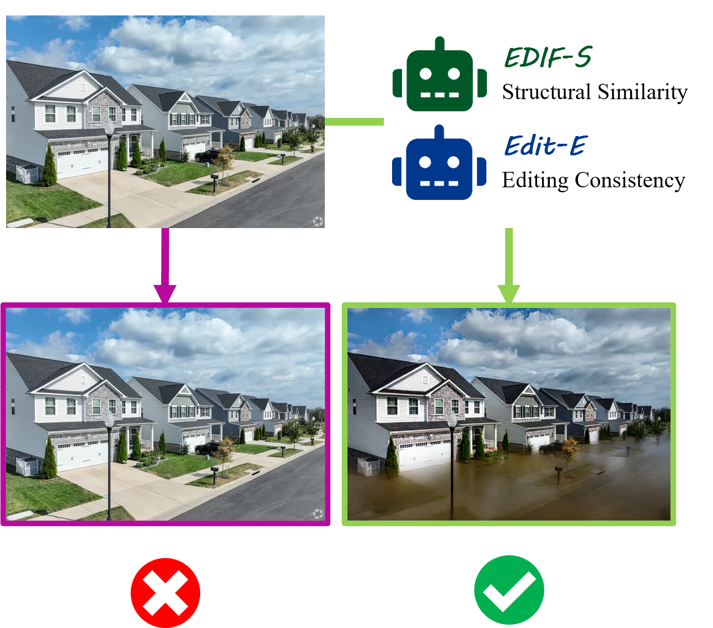

# EDIF: Feedback-Driven Structure-Preserving Image Editing

> Official implementation of the paper:  
> **EDIF: Feedback-Driven Structure-Preserving Image Editing**  

---

## 🌄 Overview

**EDIF** is a feedback-driven framework for text-based image editing that enables both structural preservation and semantic fidelity.  
It introduces two novel feedback modules:

- 🟩 **Edif-S**: Structure-aware module guided by SSIM feedback  
- 🔵 **Edif-E**: Semantic-aware module based on VLM alignment

---

## 🧠 Key Idea

<p align="center">
  
</p>

*EDIF leverages feedback from \textbf{Edif-S} and \textbf{Edif-E} to ensure structure-preserving yet instruction-faithful edits. The left image fails to reflect the instruction, while the right image (guided by EDIF) successfully transforms the scene.*

---

## 🚀 Features

- ✅ Feedback-guided editing using SSIM and VLM signals
- 🔁 Latent switching between source and edited features
- 📐 Blockwise condition modulation for fine-grained control
- 🌍 Works on real-world and synthetic scenes (e.g., surveillance, outdoor)

---

## 📦 Installation

```bash
git clone https://github.com/your-username/edif.git
cd edif
conda create -n edif python=3.10
conda activate edif
pip install -r requirements.txt
